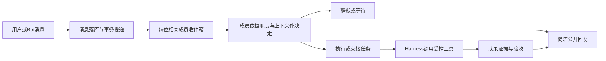

# FormaBot 后端成熟化方案

状态：设计完成，待分片实现与真实验收。依据 [核验报告](backend-research-2026-09-10.md)，实现顺序仅以 [计划](../tasks/plan.md) 为准。保留Electron、TypeScript、SQLite及DeepSeek Harness；不引入第二个自治框架与双重任务控制器。

## 1. 最终行为与职责分配

用户只需要定义身份/职位/职责、给任务和必要材料。系统负责持久化、可靠投递、隔离、取消、恢复与证据；模型根据上下文判断怎样完成职责、是否应说话、何时向同事求助。职位不等同系统权限，协调人不是永久超级管理员。

| 模型决定 | 宿主必须保证 |
| --- | --- |
| 任务含义、岗位相关性、是否回应/静默/澄清、工作方法、分工建议 | 消息身份真实、目标成员存在、投递不丢、重复事件不重复执行 |
| 对事实的分析、报告结构、质量自检、合适的回复长短 | 工具授权有效、源数据与产物存在、版本准确、状态不冒报 |
| 提议改岗、协调关系、共享资料 | 变更来源有权，保存成功才生效；普通网页/其他成员不得伪造用户指令 |

不得用岗位关键词白名单决定能不能回答，不固定“每人必须三句话/只回复收到”，不轮流强制全员发言。工作空间同一基础授权持续复用，所有新成员继承已有基础能力；角色边界不制造重复授权弹窗。职责理解不能替代OS级路径、进程和账号控制。

## 2. 数据必须有单一权威来源

在现有数据库逐步迁移，不清库重装；兼容读旧记录，迁移成功才切换写入。增加schema_versions与迁移前快照/校验；用户模型Key、工作空间及既有授权不重填。

| 实体 | 必须保存的核心字段 |
| --- | --- |
| Bot / role_versions | botId、workspaceId、名称、职责全文、结构化目标/输入/交付要求、版本、变更者、来源messageId、effectiveAt、生命周期、modelProfileId |
| Group / memberships | groupId、成员botId、加入/退出版本、协调关系及scope、群目标/约束；无层级也是合法群 |
| Message | messageId、conversationId、authorKind/authorId、姓名快照、replyTo、类型、公开正文、附件ID、sourceMessageId、taskId、创建序号 |
| Delivery / attention | messageId+recipientId唯一、delivered/seen/decided、上下文版本、decision、处理游标；“看见”与“发言”不是同一状态 |
| Task / assignment | taskId、父子关系、单一ownerId、目标、输入引用、交付标准、依赖、版本、状态、下一负责人、委派来源 |
| Event / outbox | eventId、causationId、actorId、目标、版本、投递状态；领域变更与事件事务提交 |
| Artifact / evidence | artifactId、相对路径、不可变版本/哈希、producerId、taskId、来源/日期、验证结果、批准的版本 |
| Memory | scope、sourceId、事实/偏好/摘要、时效、可信度、版本、可见范围；可纠正、可删除 |
| Capability / grant | 内置/MCP/插件/Skill来源、版本、工具schema、凭据引用、工作空间授权、账号与动作范围 |

名称用于展示和搜索，工具及@实体都传稳定ID；兼容纯文本@时必须唯一匹配。旧消息能从任务归属推定作者才迁移，否则标“历史身份待确认”，不把同名人的历史硬归为一个人。群成员/协调关系不再同时散落在JSON、teams.roster和提示文本中互相矛盾。

职责变更：用户或已授权上游发起 → 模型提取变更意图和目标 → 宿主核验来源/范围 → 事务写入新版本 → 简短告知已生效。当前任务的每次新副作用核验版本；旧版本失效就暂停重规划。有权上游仅能改变被授予范围内成员；同事发言、网页内容和角色自述不能获取管理权。变更存在实质歧义时才问用户。

## 3. 群消息如何运行

群消息是共享上下文。默认群员均有读取权限和递增游标；是否调用模型处理、是否公开回复另行决定。@指向实际成员ID，是强相关提示，不截断同条消息里的“大家收到后回复”等语义。明确仅通知不求回复时，成员可以静默。

初始小群采用每位成员独立的轻量注意力判断，按其已选真实模型运行，可批量读取自上次游标以来的新消息。输入只有角色版本、当前工作、相关群消息和可见资料，返回结构化 `work / reply / delegate / clarify / wait / silent`；不输出内部推理。普通成员有提出专业意见或阻塞提醒的机会，不由一个全能路由Bot决定谁“有资格思考”。后续大群优化必须证明召回率，不牺牲该能力节省模型调用。

强制处理的是投递与显式任务，不是强制生成聊天文本。用户直接问Bot或点名要求确认，应有回复或明确受阻；模型选择静默也要内部留决策码用于验收。无关消息、其他成员完成通知、纯技术状态，通常不公开回应。工具日志与“收到/排队/执行中”等可由任务状态承载，避免再触发所有Bot发言。

防循环：不因自己的消息再次唤醒自己；相同eventId只消费一次；同一次通知不能再次广播相同事件；状态事件不当新工作；队列批处理保留每条任务引用，不丢弃不同指令。以task进展、重复交接链和无新增信息识别空转。资源/费用上限仅作为保险，触发后标“暂停，需继续/调整”，不当成功。取消现在的“固定40次就是协作逻辑”，不以字数硬裁剪替代质量。

用户提出“@总监，你为我负责，其他人都听从你，大家收到后回复”：先持久化有权的协调关系变更，再把群体通知投递全员；总监和各成员各自基于职责确认，不复述全套岗位说明。若原话只是比喻分工，不能擅自赋予全局管理权限。

## 4. Bot怎样尽职而不越界

每个Bot是长期身份，实际上下文按 `botId + conversationId` 分开；持久身份不代表把所有私聊拼进群聊。职责全文与当前版本始终进入有效上下文；长期事实按需检索，近期对话只是其中一层。

上下文构造顺序：宿主协议/有效授权 → 当前角色与群目标 → 用户当前指令及纠正 → 当前任务/依赖/批准 → 相关对话/来源/附件 → 可见长期记忆。每条引用保留来源类型，不让网页文字变成用户授权。角色是任务范围依据，用户合法新任务超出原范围时解释、建议交接或明确改岗，不用僵硬模板拒绝所有新工作。

“只对选中文字翻译”是当次范围约束；不得自主扩成整页翻译。“做2026年运营报告”要求当前来源，不能拿过期摘要或不相关平台条款填充。记忆中的旧事实在新任务需要时重新核验；有结论冲突写出不确定性，不编造权威性。

私聊默认仅其人类用户和目标Bot可见。明确要求“把这个任务交给内容团队”时，生成最小共享包：目标群/接收者、任务目标、用户选定或任务必要的输入、允许共享的附件ID、范围来源。宿主确认该授权覆盖共享动作后放行，不要求用户重复授权工作空间。未明确授权时不能因为成员同属一个群就转发私聊/私人记忆。共享工作空间文件本身不是Bot间安全隔离，需在产品说明中如实表达；敏感记忆在受控应用数据存储，不能默认落入共享文件区。

## 5. 协作是任务所有权交接

每个任务明确一个当前负责人，可有多个并行子任务。模型通过结构化工具提出 `create_team / change_role / send_message / assign_task / handoff / report_result`；工具成功意味着事务成功，不是只返回一段建议。

交接包含：目标、输入版本、前置条件、交付标准、负责Bot、需要谁审核、回传会话。接收方可以接单、要求补材料或说明受阻；这些状态记录到任务，不一定都变成公开长回复。上游只在需要决策时收到汇总，主管不能替别人伪造已完成。

任务状态：queued → accepted → running → waiting_input / waiting_dependency / waiting_approval / blocked → submitted → verified → completed；另有failed/cancelled/interrupted。模型回执最多进入submitted；文件存在与可打开等可自动验证，内容质量用专项评估/指定审核者，人类终审按任务要求执行。简单问答允许answered，不硬要求生成文件或走多级审批。

五岗链示例：侦察员提供带来源的素材 → 策划师引用已核验素材选题 → 口播稿作者依据选题写稿 → 视频策划员依据稿件出分镜 → 复盘师在实际数据到达后复盘。没有发布后数据时进入waiting_input，不能提前编造复盘；审批未过不推进受其约束的下游。顺序由任务依赖与业务需求决定，不把五岗位写成所有用户的固定流程。

每Bot同一时刻一个有副作用的执行回合，跨Bot可并发；先默认保守并发，完成E02资源边界验证后开放。收件箱可随时收到新消息，人类纠正优先；成员模型或API失败仅阻塞该任务，不拖死全部会话。公平调度防止一个群无限占用资源。

## 6. 执行、取消、恢复

工作空间授权、职位职责、平台登录、业务外发批准是四种不同状态。OS执行限制、工具入口、MCP、插件脚本、Bash都必须经过统一授权检查。空间路径不等于沙盒；不能靠prompt或单进程组kill宣称守住边界。

资源租约包括文件写入版本、浏览器页面、账号写动作及任务子进程；同账号同页面的破坏性操作不并发。用户手动选择浏览器内容时接管该页面，暂停Bot控制，释放后按实际页面状态恢复。

每次工具操作先记intent与幂等键，再执行并记录结果。恢复时只自动重试已证明可重试的操作；发布/上传/转账等不确定是否已完成时先查目标系统或等用户核对，不盲目重放。取消传播给队列、Harness、网络、浏览器及全部后代；无法验证停止的状态明确为待核查。

SQLite事务outbox保证状态提交与待投递事件同时成立；事件至少一次投递，业务键去重。不承诺跨外部系统“恰好一次”。租约过期、进程崩溃、App更新和睡眠唤醒复用同套恢复协议。删除Bot先撤销待执行和记忆引用，再清理记录；历史姓名不是身份键。

## 7. 优质回复与优质产出

公开流只包含正式文本、结果链接与必要问题；推理/工具原始参数进入受控内部通道，不输出到群。任务状态单独更新，同一结果只发布一条可更新消息。长成果完整保存在本地产物，聊天只摘要；用户要求详细答复时仍允许展开全文，不固定字数。

研究任务建立证据表：关键主张、原文URL、发布时间/事件时间/抓取时间、支持片段、适用范围、相互冲突、是否一手。搜索负责发现，原文负责支持主张。web_search按真实服务商能力接入；浏览器用于核验/交互，不能假定每个模型都有搜索工具。访问失败就标缺口，不能把列了多个站名称为交叉验证。

交付登记文件存在、可读、类型、版本哈希、任务目标和验收项。HTML检查实际可渲染，数据计算检查输入与公式，报告检查证据相关性与时效。审阅Bot也可能错，因此规则检查、原始证据和人类抽查共同作用；有限次数修订后仍失败要报阻塞，不能无限自评刷屏。

## 8. 验收与可观测性

每次真实模型验证记录：模型ID/供应商、角色版本、任务版本、来源引用、工具结果、耗时/费用、公开消息数、交付哈希、最终状态。只记录结构化决策码和必要证据，不保存思考全文、Key、Cookie。生产日志默认本地，可由用户导出脱敏包。

基准以用户真实问题建立，至少包含下表；每个语义场景在同一配置下重复3次，首轮准入要求三次全部满足该场景硬条件，后续扩大样本报告成功率、漏回复/多余回复率与人工评分，不把3次通过当统计保证。

| 场景 | 必须观测的结果 |
| --- | --- |
| 文档创建5岗位团队、重试、重名冲突 | 真实ID、职责、成员关系正确；不生成重复或半队 |
| 私聊/群聊/@同一Bot，跨多轮重启 | 职责一致，名称变化不改变身份 |
| 人类改岗、有权上游改岗、普通成员伪造改岗 | 前两者范围内生效，第三者无权改变 |
| @总监同时要求大家回复 | 全部应答者收到且适当回应，不只有总监回复 |
| 无@专业问题、纯通知、无关闲聊 | 相关者有机会判断，无关者静默，无报到洪水 |
| 两任务同一成员、多人并行、重复投递 | 不丢任务、不并发写坏、不重复执行 |
| 前置失败、用户纠正、取消/重启 | 下游不冒进，旧版本不继续产生新副作用 |
| 私聊未授权分享/明确授权交接 | 前者不扩散，后者只分享必要资料 |
| 请求2026资料、来源无关/过期/互相冲突 | 原文相关、有时效依据、承认缺口 |
| 假装完成、空文件、错误HTML、产物覆盖 | 不验收成功；旧链接仍指向旧版本 |
| 文件硬链接/后台后代/跨账号外发 | 执行层阻止或明确受阻，不能靠模型答应 |
| 选区翻译、截图分析、更新后恢复 | 见E12/E13专项验收，不再上传整页或重配Key |

验收必须走打包App与实际模型配置。存储和调度单测可以用确定性fixture，但不得替代真实Agent任务。每片手测通过再推进，研究完成不等于实现完成。
